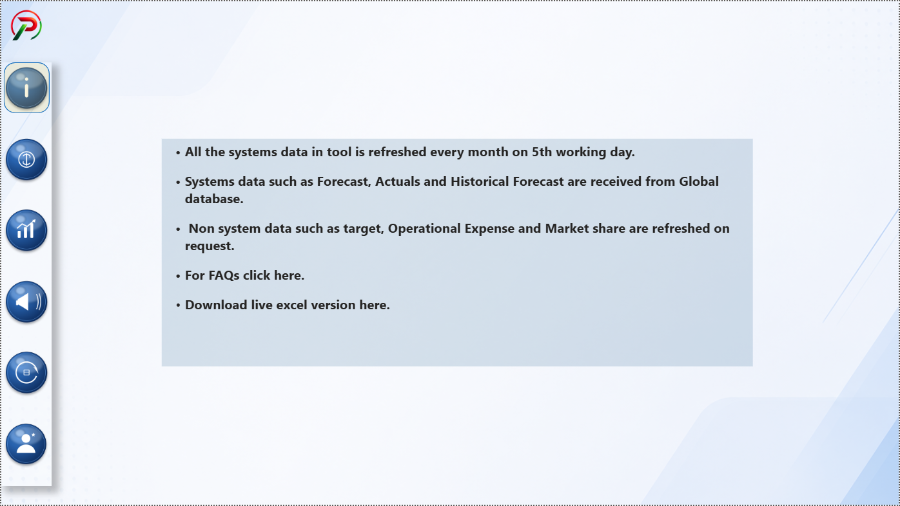
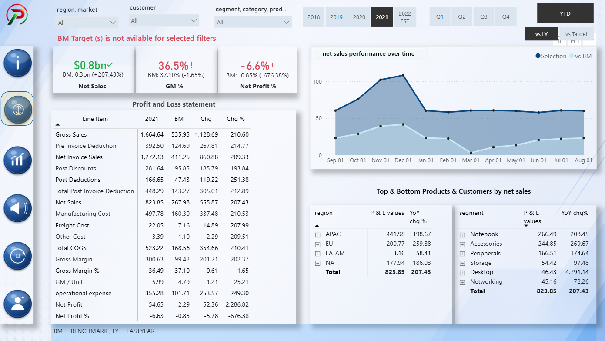
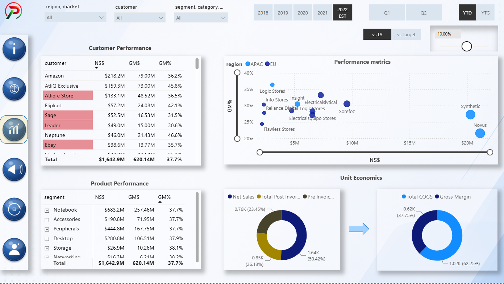
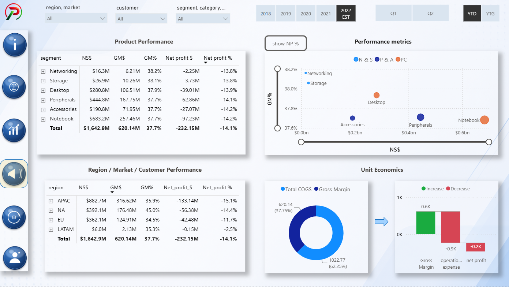
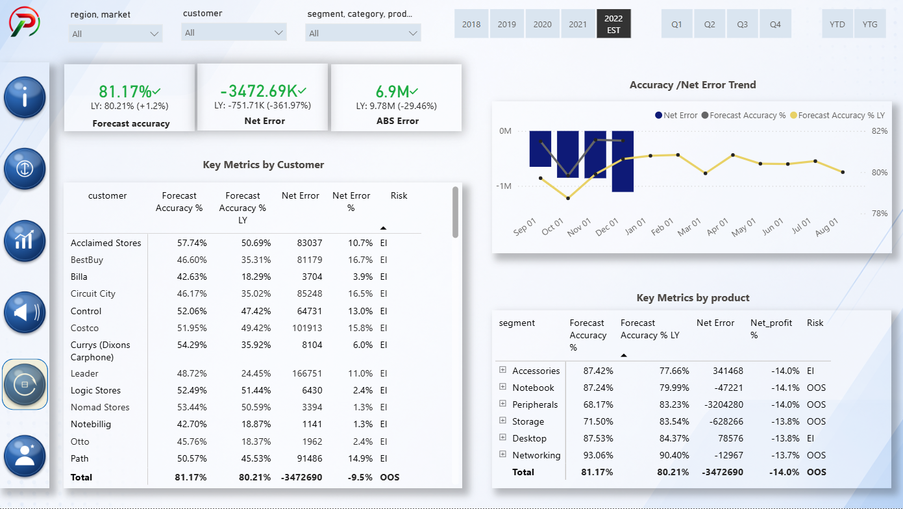
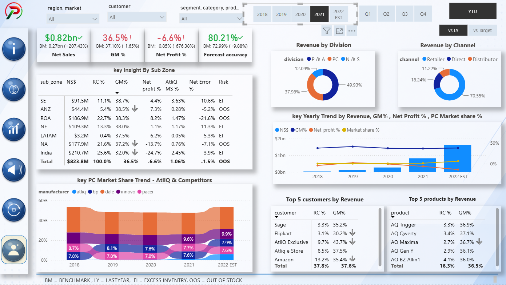

# AtliQ Business Insights 360

## Project Overview

This project aims to streamline and optimize various aspects of AtliQ Hardware's business, including Finance, Sales, Supply Chain, Executive Management, and Marketing. The primary objectives and key achievements for each perspective are outlined below.

### Live Dashboard Link

https://app.powerbi.com/view?r=eyJrIjoiY2EyYTY1ZDktNDAxMy00YmRjLWEwMTItZDVhYTQ3ZmNhOTI0IiwidCI6ImM2ZTU0OWIzLTVmNDUtNDAzMi1hYWU5LWQ0MjQ0ZGM1YjJjNCJ9&embedImagePlaceholder=true&pageName=14de7dcec0225094e480

## Finance View

### Objectives

1. Improve financial planning and budgeting processes.
2. Enhance cost control and expense management.

### Key Achievements

1. Implemented a robust financial forecasting model, resulting in more accurate budget predictions.
2. Created benchmarking against last year and target goals for budgeting.

## Sales View

### Objectives

1. Increase sales revenue and market share.
2. Enhance customer relationship management.

### Key Achievements

1. Created customer and product overall sales performance reports and unit economics analysis.
2. Identified sales trends and tracked key KPIs.

## Supply Chain View

### Objectives

1. Optimize inventory management and reduce lead times.
2. Enhance supplier relationships for cost savings.

### Key Achievements

1. Identified Forecast Accuracy %, Net Error %, and Absolute Error % trends.
2. Analyzed key metrics by customers and products to support supply management.

## Executive View

### Objectives

1. Provide an overview of the entire organization's performance.
2. Enable data-driven decision-making for top management.

### Key Achievements

1. Developed an executive dashboard for overall performance monitoring.
2. Analyzed revenue by division, customers, products, and channels, along with manufacturer performance.

## Marketing View

### Objectives

1. Increase brand visibility and customer engagement.
2. Implement data-driven marketing strategies.

### Key Achievements

1. Created region-wise and product-wise overall market performance reports and unit economics analysis.
2. Identified market trends and tracked key KPIs.

## Skills

### Learnt Power BI Fundamentals

1. Creating calculated columns and DAX measures.
2. Data modeling and data validation techniques.
3. Using KPI indicators and conditional formatting.
4. Using bookmarks to switch between visuals.
5. Page navigation using buttons.
6. Using tooltips to optimize report page space.
7. Creating dynamic titles based on applied filters.
8. Publishing and sharing reports using Power BI Service.
9. Creating a date table using M language.

## Tech Stacks

1. SQL
2. Power BI Desktop
3. DAX
4. DAX Studio
5. Power BI Service
6. Project Charter

## Business Related Terms

1. Gross Margin and Gross Margin %
2. Gross Sales and Gross Sales %
3. Pre-Invoice Deductions and Post-Invoice Deductions
4. Net Sales and Net Invoice Sales
5. Net Profit and Net Profit %
6. COGS (Cost of Goods Sold)
7. YTG (Year to Go)
8. YTD (Year to Date)
9. Direct, Retailer, Consumer, and Distributor

## Soft Skills

1. Stakeholder Mapping Analysis
2. Effective Communication and Stakeholder Feedback Management
3. Business and Domain Knowledge in Sales, Finance, Marketing, and Supply Chain

## Conclusion

This dashboard answers various business questions across different scenarios.

The report can be used to support data-driven decision-making and help improve overall business performance and profitability.

## 📷 Dashboard Preview

### Home Page

### info View

### Finance View

### Sales View

### Marketing View

### Supply Chain View

### Executive View

